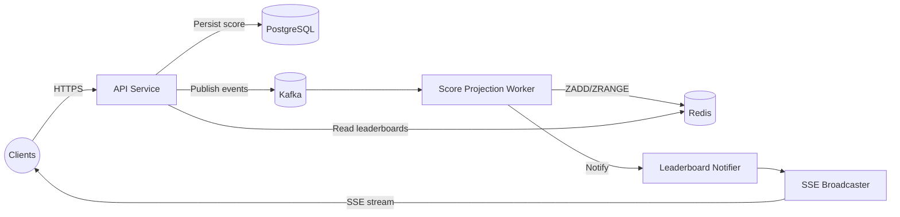
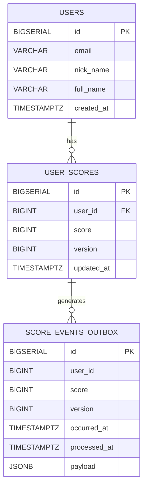
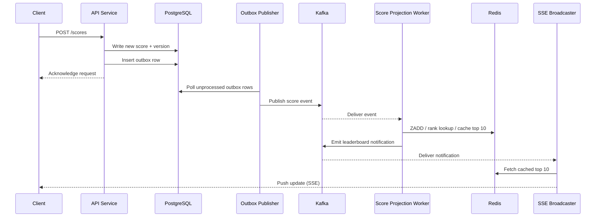
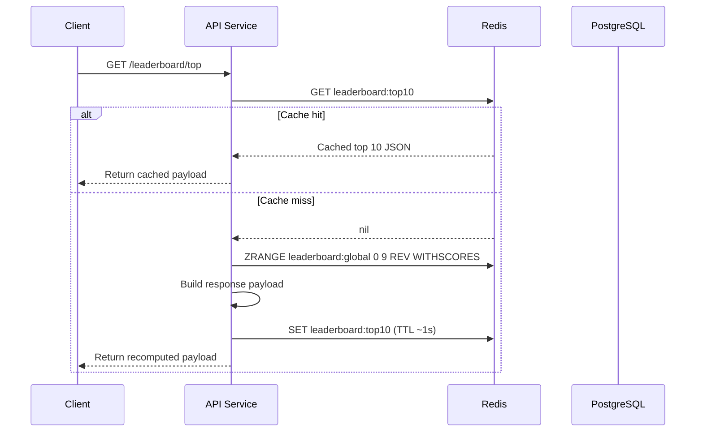
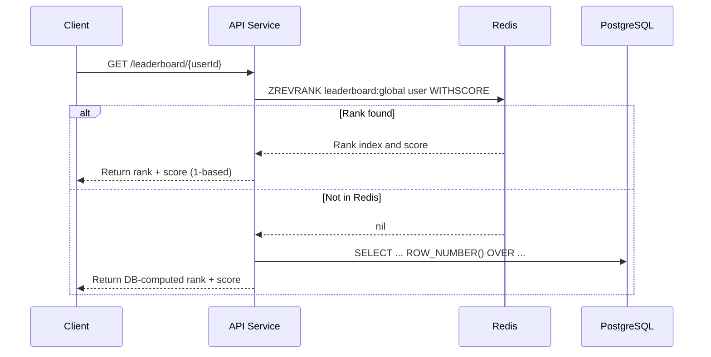
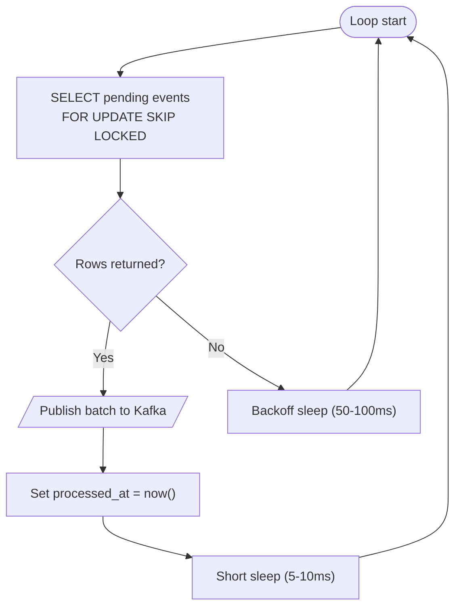

# Realtime Leaderboard Design (Kafka + Single Redis Instance)

## 1. Scope & Goals
- Provide implementation guidance for the realtime gaming leaderboard when Kafka is used for asynchronous processing and a single Redis instance powers leaderboard reads.
- Deliver near real-time top-10 leaderboard and per-user rank lookups under a peak of ~575 score updates per second.
- Ensure writes remain durable via PostgreSQL while Redis serves low-latency reads.
- Keep the system evolvable so that sharding or additional Redis replicas can be introduced later with minimal refactor.

## 2. High-Level Architecture
- **Clients** (web/mobile) interact through HTTPS + Server-Sent Events (SSE) connections exposed by the API Gateway.
- **API Service** handles REST requests for score submissions, leaderboard fetches, and user rank queries; it enforces authentication using OAuth 2.0 bearer tokens.
- **Score Command Service** receives validated score submissions from the API Service, persists the score change to PostgreSQL, and emits a message to Kafka for downstream processing.
- **Kafka** acts as the backbone for asynchronous score processing. The primary topic (`score-events`) carries score updates to downstream consumers. A secondary compacted topic (`leaderboard-notifications`) drives throttled leaderboard pushes to subscribers.
- **Score Projection Worker** (Kafka consumer) processes score events, updates Redis sorted sets, refreshes cached top-10 payloads, and publishes notification triggers when the top-10 meaningfully changes.
- **Redis (single instance)** stores leaderboard data (`ZSET`) and cached payloads for top-10 responses.
- **PostgreSQL** remains the system of record for users and their historical scores.
- **SSE Broadcaster** subscribes to leaderboard notifications and streams updates to connected clients at the throttled cadence.



## 3. Component Responsibilities
- **API Service**
  - Endpoints: `POST /scores`, `GET /leaderboard/top`, `GET /leaderboard/{userId}`.
  - Performs JWT validation, request throttling, and payload schema validation.
  - Writes scores synchronously to PostgreSQL to guarantee durability before acknowledging the client.
  - Publishes score events to Kafka within the same database transaction using the outbox pattern (see §6.1).
- **Score Command Service**
  - Encapsulated within the API codebase or deployed separately; manages the transactional write + Kafka publish.
  - Ensures score updates are idempotent by detecting and skipping stale submissions (compare incoming `score` vs stored `score`).
- **Score Projection Worker**
  - Consumes Kafka events, updates Redis sorted sets using `ZADD` and `ZREVRANK`.
  - Maintains a cached JSON blob for the global top 10 (`GET/SET current_top_10`) with a short TTL (e.g., 1s) to reduce Redis load for high read volumes.
  - Emits lightweight messages to `leaderboard-notifications` when a top-10 entry changes score or membership after throttling.
- **SSE Broadcaster**
  - Listens to notification topic, queries Redis for the latest top 10, and streams updates over long-lived HTTP responses with rate limits (e.g., max 1 update per 500ms per leaderboard channel).
  - Uses SSE reconnection semantics (`Last-Event-ID`) so clients can resume streams after transient disconnects without missing updates.
- **Operational Console / Admin UI** (optional)
  - Permits support staff to reprocess events, inspect Redis state, and replay Kafka partitions.

## 4. Data Storage Design
### 4.1 PostgreSQL
PostgreSQL remains the authoritative store for auditing and recovery.



```sql
CREATE TABLE users (
  id BIGSERIAL PRIMARY KEY,
  email VARCHAR(255) UNIQUE NOT NULL,
  nick_name VARCHAR(64) NOT NULL,
  full_name VARCHAR(128),
  created_at TIMESTAMPTZ DEFAULT now()
);

CREATE TABLE user_scores (
  id BIGSERIAL PRIMARY KEY,
  user_id BIGINT NOT NULL REFERENCES users(id),
  score BIGINT NOT NULL,
  version BIGINT NOT NULL DEFAULT 1,
  updated_at TIMESTAMPTZ NOT NULL DEFAULT now()
);

CREATE TABLE score_events_outbox (
  id BIGSERIAL PRIMARY KEY,
  user_id BIGINT NOT NULL,
  score BIGINT NOT NULL,
  version BIGINT NOT NULL,
  occurred_at TIMESTAMPTZ NOT NULL DEFAULT now(),
  processed_at TIMESTAMPTZ,
  payload JSONB NOT NULL
);

CREATE INDEX ON score_events_outbox (processed_at) WHERE processed_at IS NULL;
```
- `user_scores.version` increments with each accepted score to detect stale updates.
- The outbox table guarantees that score events are delivered exactly once to Kafka even under retries.

### 4.2 Redis
- Single Redis instance (primary only) with AOF persistence enabled.
- Keys:
  - `leaderboard:global` (`ZSET`): member=`user:{id}`, score=`user_scores.score`.
  - `leaderboard:top10` (`STRING`): JSON payload of cached top 10, TTL 1s.
  - `leaderboard:user:{id}` (`HASH`): optional cache of per-user rank/score for fast reads.
- Periodic snapshotting (RDB) every 5 minutes to accelerate recovery.
- Enable `notify-keyspace-events` if using keyspace events for debugging (not required for runtime logic).

## 5. Kafka Topics and Consumers
| Topic | Purpose | Partitions | Retention | Notes |
| --- | --- | --- | --- | --- |
| `score-events` | Score updates emitted after DB commit | 6 | 24h | 6 partitions provide headroom above 575 RPS; increase as load grows. |
| `leaderboard-notifications` | Throttled notifications for UI | 3 | 1h | Compacted + TTL to retain only latest notification per leaderboard. |

- Use a single consumer group (`score-projection-workers`) with at least two replicas for redundancy. Kafka will rebalance automatically upon failure.
- Messages contain `{ "userId": 123, "score": 4500, "version": 7, "updatedAt": "..." }`.
- Consumers must be idempotent: compare `version` to Redis stored value; ignore if stale.
- Apply dead-letter queue (`score-events-dlq`) for events that fail processing after N retries.

## 6. Interaction Flows

### 6.1 Score Update Flow



1. Client sends `POST /scores` with `{ "score": 4500 }` and authorization token.
2. API Service validates token and payload, loads current `user_scores` row.
3. If incoming score <= stored score, respond 200 with existing data (no event emitted).
4. Otherwise, begin DB transaction:
   - Update `user_scores` with new score and incremented version.
   - Insert row into `score_events_outbox` containing serialized event.
5. Commit transaction.
6. Background Outbox Publisher polls unprocessed rows, publishes each to Kafka (`score-events`), then marks `processed_at`.
7. Score Projection Worker consumes event:
   - Update Redis `ZADD leaderboard:global score member`.
   - Fetch new rank with `ZREVRANK` (0-based) and store optional `leaderboard:user:{id}` hash.
   - Read cached `leaderboard:top10`; if stale or missing, recompute via `ZRANGE leaderboard:global 0 9 REV WITHSCORES` and `SET` the JSON payload with TTL.
   - Detect top-10 change by comparing against previous snapshot (persist last snapshot hash in Redis key `leaderboard:last_digest`).
   - When changed, publish notification message to `leaderboard-notifications` (subject to throttle rules described in §8).
8. SSE Broadcaster receives notification, loads `leaderboard:top10`, and streams to clients subscribed to the global leaderboard channel.

### 6.2 Get Top 10 Flow



1. Client calls `GET /leaderboard/top`.
2. API reads the cached JSON blob (`leaderboard:top10`).
3. On cache hit, the API responds immediately with the cached result.
4. On cache miss, the API queries Redis sorted set (`ZRANGE` with `REV` + `WITHSCORES`), assembles the response, rewrites the cache with TTL ~1s, and returns the payload. PostgreSQL fallback is only used if Redis is unavailable.
5. Monitor hit rate and perceived staleness in production; adjust the TTL as usage patterns evolve to balance freshness and Redis load.

### 6.3 Get User Rank Flow



1. Client requests their stats via `GET /leaderboard/{userId}`.
2. API fetches the rank and score using `ZREVRANK` from Redis.
3. If Redis contains the member, the API returns the computed (1-based) rank and score.
4. If the member does not exist in Redis (or Redis is unavailable), the API falls back to the PostgreSQL window function to compute the rank and returns that result, noting that data may be slightly stale.

## 7. Outbox Polling Loop



- Each publisher iteration starts a database transaction, locks a batch of outbox rows (`processed_at IS NULL`) with `FOR UPDATE SKIP LOCKED`, and publishes them to Kafka before marking them processed.
- Multiple publisher instances can run safely because locked rows are skipped by other workers; failed iterations roll back, keeping the rows pending for the next poll.
- Interval guidance:
  - **Hot path**: when rows are fetched, keep the loop tight (no delay or ≤10 ms sleep) so bursts up to ~600 events/sec are drained within a few cycles.
  - **Idle path**: when no rows are found, increase the sleep to ~50–100 ms to reduce unnecessary database chatter.
  - **Scaling**: if sustained backlog exceeds targets, add additional publishers rather than shortening sleeps; each worker processes its own batch without contention.

## 8. Throttling & Rate Control
- Projection Worker maintains a Redis key (`leaderboard:last_emit_ts`) storing the timestamp of the last notification.
- Only publish a new notification if at least 500ms elapsed or if the top-10 membership changed.
- SSE layer enforces per-connection rate limiting (e.g., 20 updates/minute) to protect clients.
- REST `GET /leaderboard/top` can be served entirely from `leaderboard:top10` cache. If cache miss occurs, recompute on-demand and set TTL.

## 9. API Contract (Draft)
### POST /scores
```
Request:  { "score": number }
Response: {
  "userId": number,
  "score": number,
  "rank": number,
  "updatedAt": string
}
```
- Authentication: Bearer token.
- Returns rank after Redis update; fall back to DB rank calculation if Redis unavailable.

### GET /leaderboard/top
- Returns cached top-10 payload (`[{ userId, nickName, score, rank, updatedAt }]`).
- Served from Redis; if Redis unavailable, fallback to PostgreSQL query with LIMIT 10.

### GET /leaderboard/{userId}
- Returns `{ userId, score, rank, updatedAt }`.
- Primary path uses `ZREVRANK`; fallback uses DB window function as in README.

## 10. Operational Considerations
- **Redis Availability**: Single instance with AOF + RDB + automated backups. Deploy using managed service or run Redis with systemd + sentinel in monitor-only mode for alerting. Expect failover window in disaster scenario; document manual promotion plan.
- **Monitoring**:
  - Metrics: Redis memory usage, command latency, Kafka consumer lag, API latency, SSE broadcast counts.
  - Logs: Structured JSON logs with request IDs; Kafka consumer logs include offsets and errors.
  - Alerts: High consumer lag, Redis memory > 70%, API error rate > 1%, nightly RDB failure.
- **Scaling**:
  - Redis vertical scaling (CPU/RAM) handles increased load up to ~10M DAU. Plan upgrade path to Redis Cluster when memory usage > 60% or CPU > 70% sustained.
  - API layer scales horizontally behind load balancer; stateless design enables auto-scaling.
  - Kafka partitions can be increased ahead of load surges; ensure partition count >= number of consumer instances.
- **Deployment**:
  - Use containerized services (Docker + Kubernetes). Each service has independent deployment pipeline.
  - Apply blue/green or canary releases for API + workers to minimize downtime.
  - Database migrations run via migration service before rolling out new binaries.
- **Security**:
  - Enforce TLS everywhere.
  - Restrict Redis/Kafka to private networks; use SASL/SCRAM for Kafka.
  - API rate limiting per user to mitigate abuse.

## 11. Failure & Recovery Strategy
- **Redis failure**:
  - API continues accepting writes; Score Projection Worker queues updates (Kafka retains events).
  - When Redis returns, worker replays backlog from earliest unprocessed offset.
  - If data loss occurs, run recovery job: iterate all `user_scores` and reissue `ZADD` commands.
- **Kafka outage**:
  - Outbox table accumulates pending events; once Kafka restored, publisher drains backlog.
  - If event duplication occurs, idempotency via `version` prevents double-apply in Redis.
- **PostgreSQL outage**:
  - API rejects write operations with clear error. Reads still served from Redis but marked as eventually consistent.
- **SSE broadcaster failure**:
  - Clients fallback to polling `GET /leaderboard/top` until broadcaster recovers.

## 12. Testing & Observability
- Unit tests for API validation, transactional logic, outbox publisher.
- Integration tests with embedded PostgreSQL + Kafka + Redis (Testcontainers) covering score lifecycle.
- Load tests (e.g., Locust) targeting 600 score writes/sec and 5k leaderboard reads/sec to validate Redis latency < 10ms P95.
- Chaos testing script to recycle Redis while ensuring replay logic restores consistency.

## 13. Roadmap Considerations
- Introduce Redis Cluster when DAU approaches 50M or memory pressure > 60%.
- Add regional caches/CDN for read-heavy deployments.
- Extract SSE broadcaster into dedicated service with horizontal scaling and sharded channels.
- Explore CQRS: separate read API service that only interacts with Redis for further scale.
