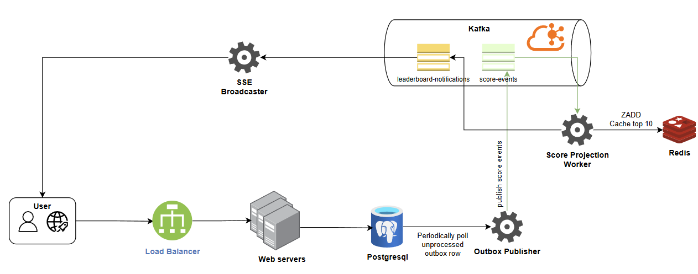

Realtime Gaming Leaderboard System
======

*<ins>Note:</ins> This document details the software architect's thought process and explains design rationale; it is not intended for implementation guidance.
For the developer-friendly design document, please refer to DESIGN.md*

Requirements
------

### Functional Requirements
- Users should be able to view top 10 users with the highest scores.
- Users should be able to view their best score and global rank in near real-time.
- Score updates require user authorization.

### Non-functional Requirements
- Score is updated and reflected on the leaderboard in near real-time.
- Low latency, high availability, scalability, reliability.

Given the target user base size is currently unspecified, we will adopt an iterative and scalable approach. We'll begin with a simple, yet robust foundation designed to serve a small user group, and in later development phases, we will strategically scale the architecture to accommodate a much larger user base.

Start with a simple application
------

We'll begin with a simple application intended for a limited user base, such as internal use within a small company.

With a small user base, performance concerns are minimal. A relational database is sufficient to store user information and scores.


Database tables:


A simple query is all it takes to fetch the 10 users who have the highest scores:
```sql
SELECT user_score.score, user_score.updated_at, users.nick_name, users.full_name FROM user_score
  JOIN users ON user_score.user_id = users.id
  ORDER BY user_score.score DESC LIMIT 10;
```

And the rank of an user can be retrieved by:
```sql
SELECT ranked_user.user_id, ranked_user.score, ranked_user.updated_at, ranked_user.row_num
FROM (
    SELECT user_id, score, updated_at, ROW_NUMBER() OVER (ORDER BY score DESC) AS row_num FROM user_score
) AS ranked_user
WHERE ranked_user.user_id = 50;
```

As the user base grows, we can implement scalability by adding more servers, placing them behind a load balancer, and setting up database read replicas:


Scale the application to serve millions of users
------
The relational database approach obviously doesn't scale well. Finding a user's rank is not performant because it essentially requires a full table scan to determine the rank.

This is when **Redis** comes to the rescue. **Redis** is an in-memory data store supporting key-value pairs. Since it works in memory, it allows for fast reads and writes.
Redis **Sorted Sets** are ideal for solving leaderboard system design problems.


### What are sorted sets
Redis **Sorted Sets** is a collection of unique strings (members) ordered by an associated score. You can think of sorted sets as a mix between a Set and a Hash. Like sets, sorted sets are composed of unique, non-repeating string elements, so in some sense, a sorted set is a set as well.

Let's take a look at the Redis operations we will use to build our leaderboard:
- `GET key`/ `SET key value`: Cache the top 10 users with the highest scores.
- `ZADD key score member`: Insert the user into the set if they don't exist yet. Otherwise, update the score for the user. This action has the time complexity of $O(log(N))$, where N is the number of elements in the sorted set.
- `ZRANGE key start stop`: Fetch a range of users sorted by the score. We can specify the number of entries and the position to start from. Time complexity is $O(log(N)+M)$ with N being the number of elements in the sorted set and M the number of elements returned.
- `ZREVRANK key member`: Returns the rank of member in the sorted set stored at key, with the scores ordered from high to low. The rank (or index) is 0-based, which means that the member with the highest score has rank 0. This action has the time complexity of $O(log(N))$.

### Workflow with sorted sets
#### 1. A user updates his score


Example command to add/update a user score:
```
ZADD leaderboard 1234 anhba817
ZREVRANK leaderboard anhba817 WITHSCORE
GET current_top_10
ZRANGE leaderboard 0 9 REV WITHSCORES
SET current_top_10 "[(user1,score1),(user2,score2),...]"
```

#### 2. A user fetchs the top 10 global leaderboard


#### 3. A user want to get their position in the leaderboard:


Asynchronous processing with message broker
------
Currently, updating a user's score involves several synchronous operations (writing to PostgreSQL, updating Redis, broadcasting the new top 10). This synchronous workload is a bottleneck and will likely cause performance problems under high load.
We can introduce a Kafka message broker to decouple these actions and allow them to execute independently.



This new processing architecture allows for significant performance improvements. To estimate the required capacity, we start with our baseline: assuming 10 million Daily Active Users (DAU) evenly distributed over 24 hours results in an average load of approximately 115 Requests Per Second (RPS) ($\text{10,000,000} / (\text{24} \times \text{60} \times \text{60}) \approx \text{115 RPS}$). However, usage is rarely uniform. To account for traffic spikes, we'll assume the peak load is five times the average. Therefore, our estimated peak traffic capacity is 575 RPS ($\text{115 RPS} \times \text{5}$).
Given this high load, sending the updated leaderboard whenever the top 10 changes is impractical and would likely overwhelm both the user interface and connected clients.

We can apply a throttle mechanism to manage and control the frequency of leaderboard updates effectively:


Scaling Redis
------

While a single Redis instance is sufficient to handle $\text{10 million}$ Daily Active Users (DAU) for both storage and Query Per Second (QPS) needs, scaling to $\text{100 million}$ DAU (a $\text{10}$-fold increase) would certainly overwhelm a single cache, requiring a new approach.

This calls for a sharding solution. One effective strategy is to divide the total score range into fixed partitions. For instance, if scores run from $\text{1}$ to $\text{1000}$, we could use 10 shards, with each shard responsible for a $\text{100-point}$ range. Crucially, this is a simplified example; in a production environment, the partitioning logic must be carefully tuned to ensure a relatively even distribution of data and load. Under this approach, the application code handles the data sharding logic.

To generate the overall top 10 leaderboard, we query the highest-score shard and fetch the top 10 users directly. To determine a specific user's global rank, we must perform a two-step calculation: first, find their rank within their current score shard; second, sum the total number of users who have higher scores across all other shards.


System failure recovery
------
In the event the Redis cluster experiences a large-scale failure, we have a clear recovery path. We can use the persistent data in the PostgreSQL database to rebuild the entire leaderboard. This involves running an offline script that iterates through all database entries and calls the Redis ZADD command once for each entry, allowing us to quickly restore service.

Further improvement:
------
- Decouple Front-end Services: Separate the web server (handling static content and API calls) from the WebSocket server (handling real-time updates) and implement service discovery to manage communication between them.
- Adopt Microservices: Transition to a microservice architecture by breaking the system into multiple smaller, independent services. This will allow for independent development, deployment, and granular scaling of each function.
- Adopt CQRS: Split the write (command) and read (query) responsibilities into distinct services to simplify scaling and enable specialized optimizations for each workload.
